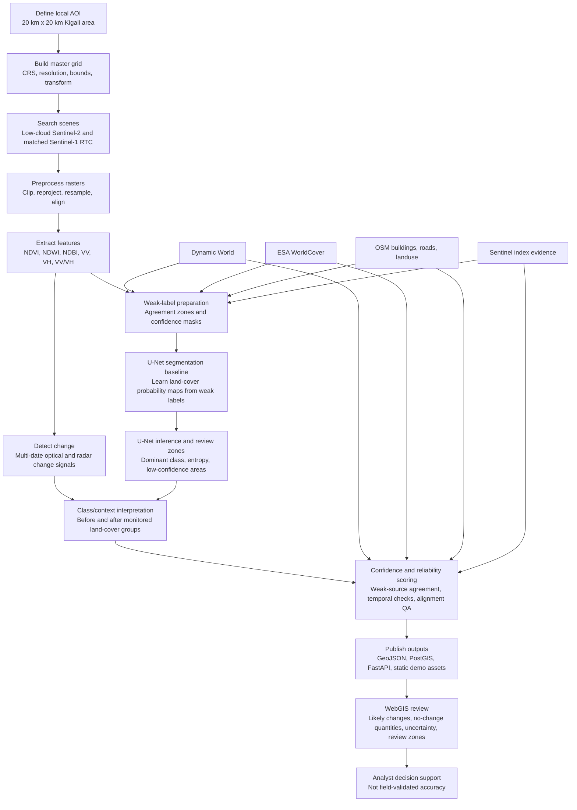

# Confidence-Aware Land-Cover Change Monitoring

Local-first GeoAI portfolio project for near-real-time peri-urban land-cover
change monitoring over a 20 km x 20 km Kigali AOI. The system combines
Sentinel-2 optical indices, Sentinel-1 radar features, weak-source reliability
checks, PostGIS, FastAPI, and a MapLibre WebGIS.

## Problem Statement

Peri-urban land-cover change can happen faster than conventional mapping
updates, especially around growing cities. This project asks: can open
Sentinel-1/2 imagery, weak reference sources, and confidence-aware screening
produce useful local change candidates before field validation is available?

The goal is not national production mapping. The goal is a reproducible,
local-first prototype that helps analysts inspect likely change, uncertainty,
and review priorities for one manageable AOI.

## What It Does

- Searches and prepares Sentinel-1/2 monitoring scenes for a local AOI.
- Clips and aligns analysis rasters to a common master grid.
- Computes Sentinel-2 indices, Sentinel-1 radar features, and change signals.
- Publishes likely change polygons with before/after land-cover context.
- Reports changed and stable no-change quantities by monitored group.
- Shows confidence, uncertainty, weak-source compatibility, and review zones.
- Provides a local FastAPI/PostGIS backend and a static hosted WebGIS demo.

## Data Sources

- Sentinel-2 L2A optical imagery for visible/NIR/SWIR bands and indices such as NDVI, NDWI, and NDBI.
- Sentinel-1 RTC radar imagery for VV, VH, and VV/VH ratio features.
- Dynamic World, ESA WorldCover, OSM buildings/roads/landuse, and Sentinel index evidence as weak-label or agreement sources.
- Local AOI configuration in `configs/aoi.geojson`.
- Derived demo outputs exported from local processing into `web/public/demo/` and `docs/app/demo/`.

Raw satellite imagery and heavy intermediate rasters are intentionally kept out
of Git. Only lightweight catalogs, reports, demo tiles, and selected public
outputs are tracked.

## Methodology



In short: the system aligns Sentinel-1/2 data to one AOI master grid, extracts
optical and radar features, detects likely change, and uses U-Net as a
weak-supervised segmentation baseline to add land-cover probability, entropy,
and review-zone evidence. The result is checked against weak evidence sources
and published as confidence-aware WebGIS outputs, not field-validated labels.

## Current Demo Statistics

```text
AOI:              20 km x 20 km Kigali peri-urban area
Published changes: 2,076
Changed area:      60.5 km²
No-change area:    339.5 km²
Mean confidence:   0.88
```

Open the local WebGIS:

```text
http://localhost:5173/
```

Hosted portfolio WebGIS:

```text
https://nkusial.github.io/LCC_Monitor_RwaKig/app/
```

## Trust And Limitations

This project does **not** claim field-validated land-cover accuracy. The current
prototype is a confidence-aware screening system: it highlights likely changes,
shows reliability evidence, and marks areas that need review.

The monitored-group change model is intentionally conservative. Because the
U-Net baseline was trained from weak labels rather than field reference samples,
and because the available 2023-2026 training/test stack is still limited for a
mountainous, mixed peri-urban landscape, model confidence is not yet strong
enough to treat the outputs as final land-cover truth. The WebGIS should be read
as a review and prioritization tool: it is useful for finding likely change and
uncertainty hot spots, but it still needs more temporal coverage, stronger weak
label cleaning, and independent expert samples before stronger accuracy claims
are made.

Use the outputs as:

- likely change candidates
- weak-evidence compatibility indicators
- uncertainty and review-zone guidance
- a reproducible local-first GeoAI engineering prototype

Do not use the outputs as:

- official land-cover labels
- field-validated accuracy claims
- national-scale operational monitoring

## Repository Governance

This public release is organized for review and reuse:

- `main` is the stable public portfolio branch.
- `dev` is for active development after the public release.
- `feature/*` branches are for experiments, model trials, and UI changes.
- `.env.example` is the public configuration template.
- `.env`, credentials, raw rasters, private intermediate data, and model artifacts stay out of Git.
- GitHub Issues and `docs/ISSUE_BACKLOG.md` are used as the roadmap.
## Repository Layout

```text
backend/     FastAPI app and routers
configs/     AOI, pipeline, master-grid, and class settings
data/        Local catalogs, processed rasters, and outputs
db/init/     PostGIS extensions and schema
docs/        Architecture, operations, validation, phases, and portfolio docs
ml/          Model architecture and weak-supervision utilities
notebooks/   AOI scouting and experiments
pipelines/   Scene search, preprocessing, change detection, ML, and exports
tests/       Regression and validation tests
web/         React, TypeScript, and MapLibre WebGIS
```

## Quick Start

Create the Conda environment if needed:

```powershell
cd path\to\Geospatial_MLops
conda env create -f environment.yml
conda activate realtime_LCC_Rwkig
```

Start backend services:

```powershell
cd path\to\Geospatial_MLops
conda activate realtime_LCC_Rwkig
docker compose up -d postgis
uvicorn backend.app.main:app --reload
```

In a second terminal:

```powershell
cd path\to\Geospatial_MLops\web
conda activate realtime_LCC_Rwkig
npm run dev
```

Useful local URLs:

```text
API docs:  http://127.0.0.1:8000/docs
WebGIS:    http://localhost:5173/
```

## Run The Workflow

Use the local runner for staged processing:

```powershell
python pipelines/run_local_pipeline.py --help
python pipelines/run_local_pipeline.py validate
```

Core scripts are also runnable directly when developing a specific stage:

```powershell
python pipelines/01_search_scenes.py --no-db
python pipelines/03_preprocess.py
python pipelines/04_detect_change.py
python pipelines/05_score_confidence.py
python pipelines/07_validate_outputs.py
python pipelines/39_coregistration_qa.py
```

See [Operations](docs/OPERATIONS.md) for the full command reference.

## Documentation Map

- [Architecture](docs/ARCHITECTURE.md): system design and data flow.
- [Operations](docs/OPERATIONS.md): commands for running services, pipeline stages, and tests.
- [Validation and reliability](docs/VALIDATION.md): confidence, uncertainty, weak-source checks, and review zones.
- [Project phases](docs/PHASES.md): completed work phase by phase.
- [Portfolio review guide](docs/PORTFOLIO_REVIEW.md): reviewer-facing explanation and demo talking points.
- [Changelog](CHANGELOG.md): chronological release progress.
- [CI/CD](docs/CI_CD.md): automated checks and release packaging.
- [Hosted docs](docs/HOSTED_DOCS.md): GitHub Pages publishing structure.
- [Publishing guide](docs/PUBLISHING.md): hosted documentation and WebGIS publishing.
- [Release checklist](docs/RELEASE_CHECKLIST.md): pre-release checks.
- [GitHub release notes](docs/GITHUB_RELEASE_NOTES.md): release text.
- [Demo script](docs/DEMO.md): live walkthrough for the current prototype.
- [Development backlog](docs/ISSUE_BACKLOG.md): next engineering tasks.

Specialized technical notes live under `docs/`, including weak labels, external
weak sources, U-Net inference, topography features, reliability hardening, and
future ML/MLOps roadmap documents.

## Technical Index

Detailed implementation history is kept out of this README and tracked in
[Project phases](docs/PHASES.md). These links are the main technical anchors:

- WebGIS screenshots: `docs/assets/01_webgis_overview.png`, `docs/assets/02_api_docs.png`, `docs/assets/03_change_summary.png`, `docs/assets/08_validation_overlay.png`, `docs/assets/09_validation_workflow.png`.
- Harmonization and labels: [Class harmonization](docs/CLASS_HARMONIZATION.md), [Weak labels](docs/WEAK_LABELS.md), [External weak sources](docs/EXTERNAL_WEAK_SOURCES.md).
- Training data: [Patch dataset](docs/PATCH_DATASET.md), [Training scene discovery](docs/TRAINING_SCENES.md), `training_stack_manifest_2023_2026.json`.
- ML workflow entry points: `09_unsupervised_validation.py`, `15_train_unet_baseline.py`, `16_preprocess_training_pairs.py`, `17_generate_training_patch_dataset.py`, `18_run_unet_inference.py`, `19_mosaic_unet_predictions.py`, `20_full_aoi_unet_inference.py`, `21_validate_unet_full_aoi.py`, `22_export_dynamic_world.py`, `23_temporal_unet_consensus.py`, `29_ingest_topography.py`.
- Reliability upgrade notes: [WEAK_SUPERVISION_RETRAINING.md](docs/WEAK_SUPERVISION_RETRAINING.md), [Reliability hardening](docs/RELIABILITY_HARDENING.md).

## Validation Status

```text
Validation: Unsupervised clusters and weak-source compatibility checks
Silhouette score:  0.4459
Accuracy claim:    none
```

## Validation

Run the local quality gates:

```powershell
conda activate realtime_LCC_Rwkig
pytest -q
python pipelines/07_validate_outputs.py
python pipelines/39_coregistration_qa.py
```

Frontend build:

```powershell
cd web
npm run build
```

Expected result:

```text
tests pass
validation report status: ok
geospatial alignment: master grid validated
co-registration QA: no diagnostic shift warning
```

## Main Outputs

```text
data/outputs/monitoring_change_scored.geojson
data/outputs/monitoring_change_scored_summary.json
data/outputs/validation_report.json
data/outputs/coregistration_qa_report.json
web/public/demo/
docs/app/
```

## Future Improvements

- Add time-window change detection for 2023-2024, 2024-2025, and 2025-2026 monitoring periods, with a WebGIS filter for each interval.
- Add small expert reference samples for independent accuracy assessment.
- Increase clean multi-date Sentinel-1/2 training coverage before expecting a major confidence gain.
- Improve the current U-Net baseline only after strengthening labels and temporal sampling; possible future experiments include a ResNet encoder or DeepLab-style segmentation model.
- Upgrade the self-supervised track toward stronger temporal or transformer-based encoders.
- Use embedding-based review samples to guide future expert labeling and U-Net retraining.
- Deploy the full FastAPI/PostGIS stack when hosted dynamic backend access is required.

Raw Sentinel imagery and heavy local processing artifacts should remain local
unless deliberately exported as small demo assets.


