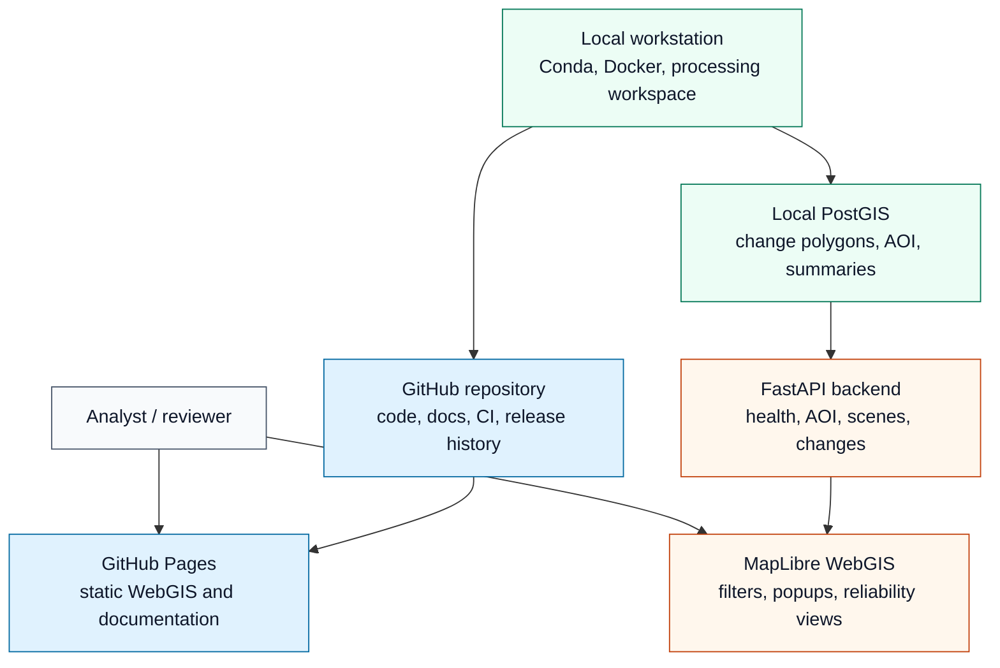
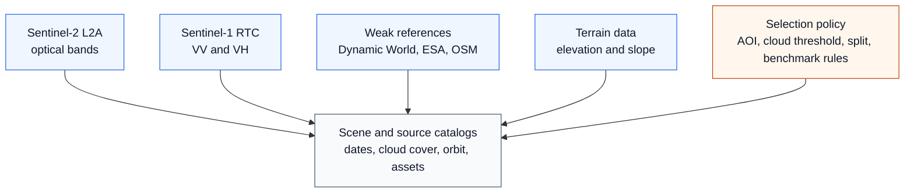
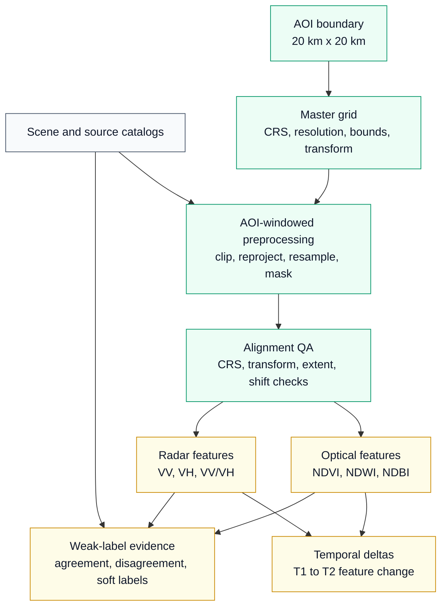
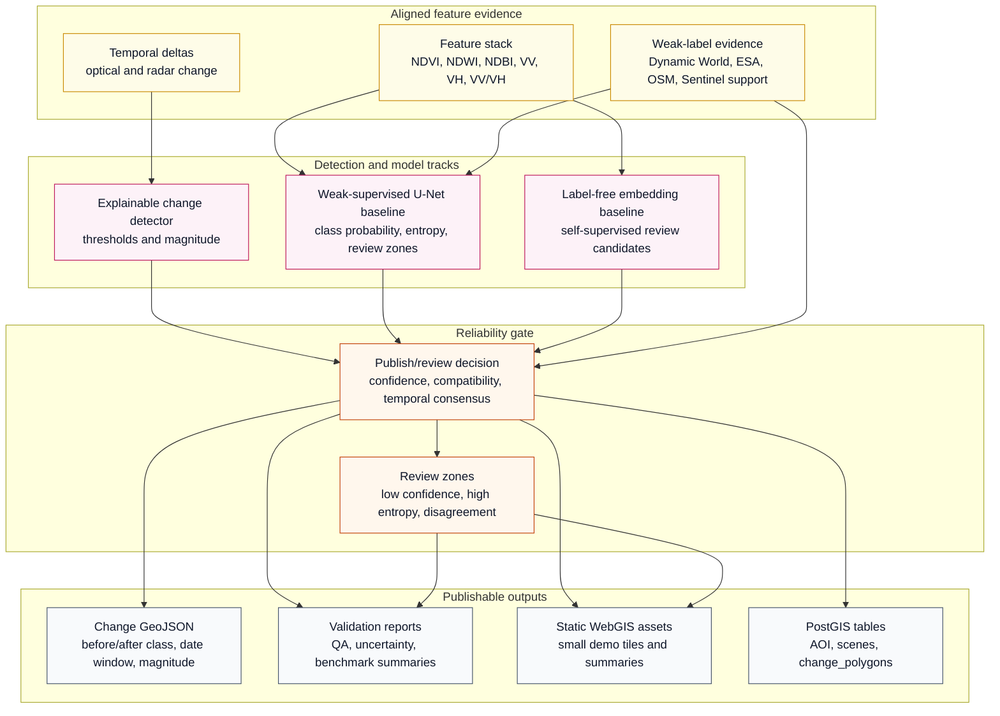
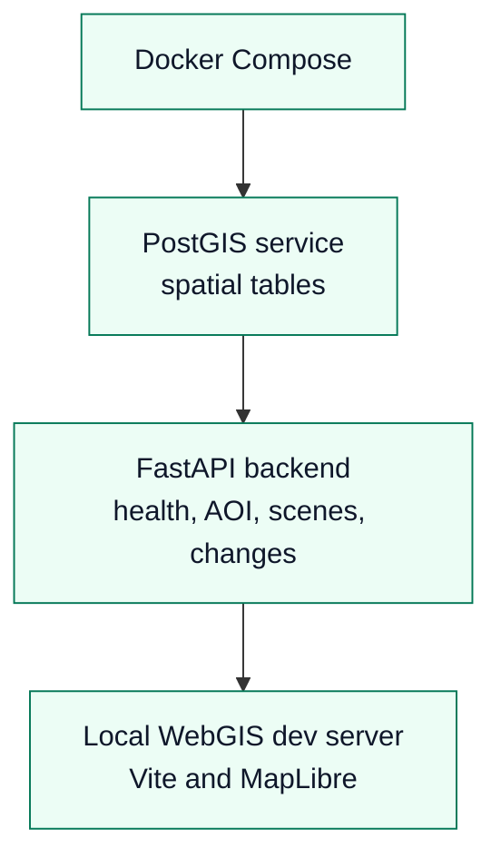
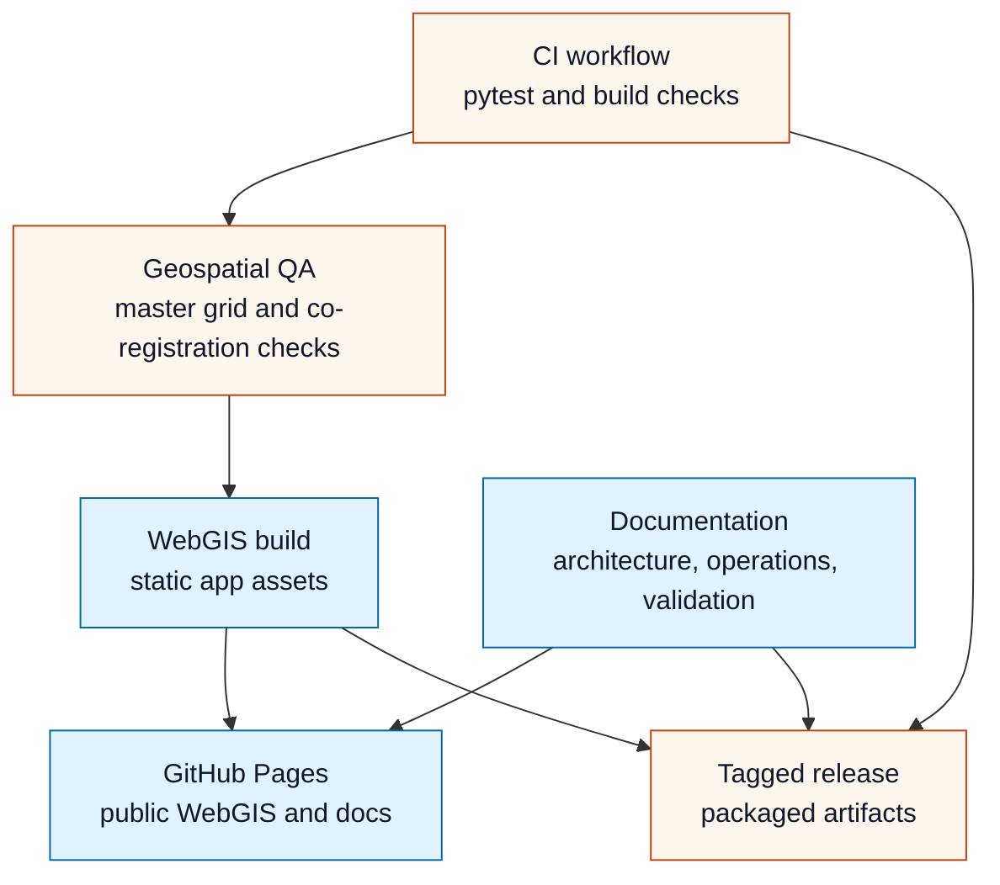

# Architecture

## Architecture Goals

This project is a local-first GeoAI monitoring platform for a 20 km x 20 km
Kigali peri-urban AOI. The architecture is designed to make land-cover change
candidates reproducible, inspectable, and honest about uncertainty when field
reference data is not yet available.

The system separates five concerns:

- open satellite and weak-reference data acquisition
- AOI-windowed geospatial processing on a shared master grid
- change detection, weak-supervised ML, and reliability scoring
- local API/database services for dynamic inspection
- lightweight public WebGIS/docs delivery for portfolio review

The diagrams below are intentionally split into compact views so they remain
readable in GitHub preview, even when the page is zoomed.

## System Context



**Notes:** GitHub Pages is the public static delivery target. FastAPI and
PostGIS are part of the local dynamic runtime, so the public site can be viewed
without exposing a hosted database or backend service.

## Processing Architecture: Data Foundation

### Source Registry



**Notes:** Source registration is separated from raster processing. This keeps
sensor metadata, weak-reference provenance, cloud cover, orbit, date windows,
and train/test split rules visible before any model or change detector is run.

### Grid-Aligned Feature Preparation



**Notes:** All raster-derived evidence must pass through the same AOI and master
grid logic before comparison. This is the control point that prevents apparent
change from being caused by CRS, transform, resolution, or extent mismatch.

## Processing Architecture: Detection And Reliability



**Notes:** The platform does not treat a U-Net class as truth. Rule-based change
signals, weak-supervised U-Net evidence, self-supervised review candidates, and
weak-source compatibility all feed the reliability gate. The gate decides what
is publishable and what remains a review priority.

## Runtime And Delivery Architecture

### Local Dynamic Runtime



**Notes:** The local runtime is the dynamic version of the system. It is used for
backend development, database-backed API testing, and local WebGIS inspection.
It is not required for the public static GitHub Pages demo.

### Static Delivery And Automation



**Notes:** CI validates the code and build. CD is static-artifact delivery: the
WebGIS and documentation are published through GitHub Pages, while tagged
releases package reproducible artifacts. Hosted FastAPI/PostGIS deployment is a
future step, not part of the current public release.

## Key Data Contracts

| Contract | Purpose | Main fields or assets |
| --- | --- | --- |
| AOI GeoJSON | Defines the project boundary and display fit | geometry, CRS assumptions |
| Master grid | Forces consistent raster alignment | EPSG, transform, bounds, resolution, width, height |
| Scene catalog | Records selected Sentinel-1/2 acquisitions | date, sensor, tile, cloud cover, orbit, asset links |
| Feature stack | Analysis-ready raster inputs | NDVI, NDWI, NDBI, VV, VH, VV/VH, deltas |
| Weak-label stack | Independent evidence and review masks | Dynamic World, ESA, OSM, Sentinel index evidence |
| Change GeoJSON | Public WebGIS and API change records | before class, after class, date window, magnitude, confidence, reliability |
| Validation reports | Reviewer-facing reliability evidence | alignment QA, weak-source compatibility, review burden, benchmark notes |

## Quality Gates

The platform does not publish change candidates only because a model produced a
class. It applies staged reliability controls:

1. **Geospatial alignment gate:** rasters must match the AOI master grid before
   change detection or model inference.
2. **Temporal gate:** change should be tied to an explicit before/after date
   window, not an unspecified event date.
3. **Weak-source gate:** Dynamic World, ESA WorldCover, OSM, and Sentinel
   evidence are used as compatibility checks, not field accuracy labels.
4. **Uncertainty gate:** low confidence, high entropy, and weak-source
   disagreement are routed to review zones.
5. **Benchmark gate:** held-out periods, such as the 2026 benchmark, must not be
   used for model tuning and final evaluation at the same time.

## Design Choices

- **Local-first by default:** raw processing, PostGIS, and FastAPI run locally so
  the project remains reproducible without cloud infrastructure.
- **Static public demo:** GitHub Pages serves lightweight WebGIS assets and
  documentation. This is continuous delivery for public artifacts, not full
  backend cloud deployment.
- **Master-grid discipline:** every raster-derived layer should be aligned to
  the same CRS, transform, resolution, and AOI bounds before comparison.
- **Explainability before complexity:** rule-based deltas, weak-source checks,
  U-Net probabilities, entropy, and review zones are exposed to users rather
  than hidden behind a single accuracy number.
- **No field-accuracy claim:** weak labels and public demo outputs support
  screening and prioritization; independent expert samples are still required
  for formal accuracy assessment.

## Current Monitoring Groups

```text
vegetation
built_up
water_moisture
bare_sparse
mixed
unknown
```

## Known Limitations

- The public WebGIS currently demonstrates selected monitoring intervals rather
  than a complete operational 2023-2026 time-window alert history.
- The U-Net baseline is weak-supervised and should be treated as a review aid,
  not a field-validated classifier.
- Mixed Sentinel pixels, topographic effects, moisture, haze, and seasonal
  vegetation can produce ambiguous change evidence.
- Full hosted backend deployment is not part of the current public release; the
  FastAPI/PostGIS stack remains local-first until a dynamic hosted service is
  required.
