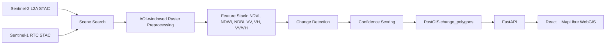

# Architecture

## System Overview



## Design Choices

- Local-first: all derived rasters, catalogs, and outputs are stored under `data/`.
- AOI-windowed raster reads: Sentinel tiles are clipped by raster window before processing.
- Explainable baseline: the first detector uses spectral/radar deltas, thresholds, and confidence scoring.
- PostGIS-backed API: publish-ready polygons are stored in `change_polygons` with rich JSONB properties.
- WebGIS inspection: published polygons are filterable by monitored land-cover group and confidence.

## Data Flow

1. Search Sentinel-2 scenes over the Kigali AOI.
2. Build a multi-date Sentinel-1/2 monitoring stack.
3. Clip rasters to the AOI and align analysis-ready features to the same grid.
4. Compare consecutive monitoring dates.
5. Create candidate change polygons with before/after states and change magnitude.
6. Score final confidence and publish high-confidence records to PostGIS.
7. Serve summaries and GeoJSON to the WebGIS.

## Current Monitoring Groups

```text
vegetation
built_up
water_moisture
bare_sparse
mixed
unknown
```

## Known Limitations

- The current stack is portfolio-scale, not production-scale.
- There are only three monitoring dates in the current demo stack.
- Some radar-only changes may reflect orbit or moisture effects rather than true land-cover change.
- The detector is explainable and rule-based; supervised ML needs labels and a larger time series.
