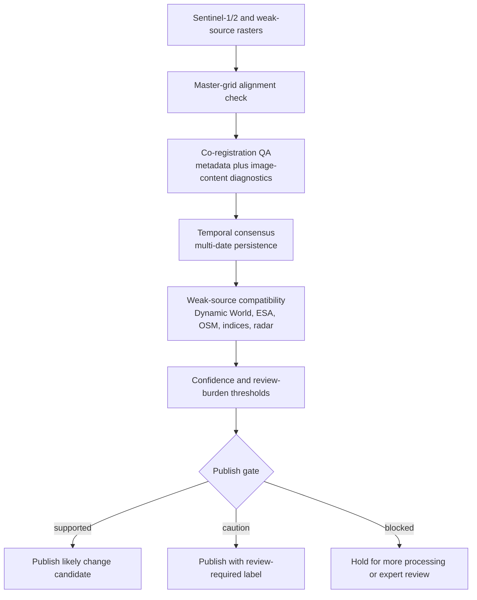

# Improvement Track

This track turns the next reliability upgrades into explicit controls around
the current prototype. It does not replace the existing local-first pipeline;
it adds stronger checks before change candidates are treated as publishable.

## Alert Publication Gate



## 1. Co-Registration QA

The project already uses a master-grid contract and a co-registration QA script.
The improvement is to make that QA a formal gate. A raster can be aligned by
metadata and still look suspicious in the WebGIS if one source has residual
orthorectification, tile, or display tiling issues. The QA report therefore
combines:

- CRS, transform, bounds, width, and height checks.
- Diagnostic image-content shift checks against a Sentinel-2 reference.
- Clear caveats that SAR, optical, weak labels, and model outputs do not share
  identical radiometry.

If the QA status is a warning, the layer can still be reviewed, but the system
should not treat affected areas as high-confidence alert evidence.

## 2. Stronger Temporal Consensus

Single-date model predictions can be unstable. The temporal consensus gate uses
multi-date U-Net outputs to identify pixels that persist across dates and pixels
that change class too easily. Low-consensus pixels are not automatically wrong,
but they should be treated as review zones before publishing change alerts.

## 3. U-Net Versus Self-Supervised Comparison

The supervised track is the current weak-supervised U-Net baseline. Its role is
to produce class probability, entropy, and full-AOI review-zone rasters from
weak labels. The next comparison track is self-supervised or deep-clustering:

- train or extract embeddings from Sentinel-1/2 multi-date stacks
- cluster or detect anomalies in embedding space
- interpret clusters with Dynamic World, ESA WorldCover, OSM, indices, and radar
- compare review burden, weak-source compatibility, temporal stability, and
  uncertainty against the U-Net track

This comparison is about reliability and usefulness, not field accuracy.
Independent labels are still required for a real confusion matrix.

## 4. Lightweight Public Demo Assets

The public demo should contain only small, explainable derivatives:

- GeoJSON summaries and selected public polygons
- JSON reliability summaries
- PNG or tile derivatives for WebGIS layers
- hosted documentation

Raw Sentinel data, processed GeoTIFF stacks, private credentials, local model
checkpoints, and heavy intermediate artifacts should remain local or private.

## 5. Hosted FastAPI/PostGIS Deployment

The full FastAPI/PostGIS stack should be hosted only when an online dynamic
backend is required. The current project remains local-first, with a static
hosted WebGIS for portfolio review. A hosted backend would require:

- managed or self-hosted PostGIS
- HTTPS
- restricted CORS
- secret management
- scheduled scene monitoring
- object storage for raster artifacts
- monitoring and backups

Until those pieces are needed, the local Docker/FastAPI/PostGIS workflow is the
safer reproducible development target.

## Run The Improvement Reports

```powershell
conda activate realtime_LCC_Rwkig
python pipelines/40_improvement_track_report.py
python pipelines/41_package_public_demo_manifest.py
```

The generated reports summarize whether the current prototype should publish
supported candidates, publish with review-required labels, or hold changes for
more processing.
