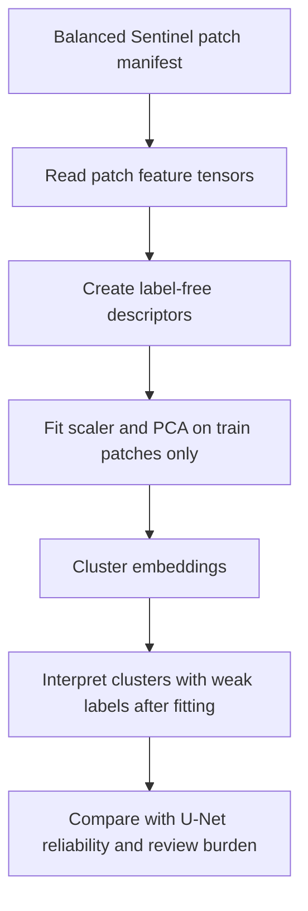

# Label-Free Embedding Baseline

This phase starts the unsupervised deep-learning comparison track without
pretending that a trained self-supervised model already exists.

It builds compact Sentinel-1/2 patch embeddings from feature statistics only,
clusters those embeddings, and uses weak labels only after clustering for
interpretation.

## Why This Exists

The U-Net track is weak-supervised: it needs pseudo-labels from Dynamic World,
ESA WorldCover, OSM, Sentinel indices, radar evidence, and high-confidence
change polygons.

The label-free embedding baseline asks a different question:

> If the model sees only Sentinel and terrain features, do the patches organize
> into meaningful groups before labels are applied?

That helps decide whether a future self-supervised encoder or deep-clustering
model is worth training.

## Method



The current descriptor uses per-feature summary statistics:

- mean
- standard deviation
- 10th percentile
- median
- 90th percentile

These descriptors are not a deep neural network yet. They are a lightweight
label-free baseline that establishes the comparison protocol.

## No-Cheating Rules

- 2026 frozen benchmark patches are excluded from fitting.
- Weak labels are not used to fit the scaler, PCA, or clusters.
- Weak labels are used only for post-hoc cluster interpretation.
- No field accuracy is claimed.

## How To Run

```powershell
conda activate realtime_LCC_Rwkig
python pipelines/44_label_free_embedding_baseline.py
```

The report is written to:

```text
data/outputs/label_free_embedding_baseline_report.json
```

## How To Read The Result

- `silhouette_score`: internal embedding-space coherence, not accuracy.
- `coherent_cluster_fraction`: fraction of clusters where one weak-label
  interpretation dominates.
- `cluster_profiles`: post-hoc interpretation of each cluster using weak labels.

The next implemented step is
[Self-Supervised Embedding Track](SELF_SUPERVISED_EMBEDDING_TRACK.md), which
uses a lightweight autoencoder to learn patch embeddings without labels while
keeping the same no-leakage rules. A later architecture can replace that
autoencoder with a convolutional or temporal encoder.
