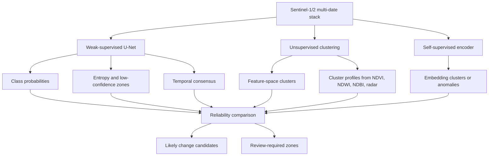

# Model Track Comparison

This note separates three ideas that can otherwise become confusing:

- weak-supervised U-Net segmentation
- unsupervised feature clustering
- self-supervised/deep-clustering embeddings

The comparison is not an accuracy assessment. It is a reliability and review
burden assessment for a project stage where no independent field labels exist.

## Current Interpretation



## What U-Net Adds

U-Net is useful when weak labels exist. In this project it adds:

- dominant land-cover class surfaces
- class probability and confidence
- entropy maps for uncertainty
- full-AOI inference
- temporal consensus across dates

Its limitation is that it can inherit bias from weak labels. The frozen 2026
benchmark is therefore kept as a no-cheating stress test.

## What Unsupervised Clustering Adds

Unsupervised clustering does not need labels. It is useful for:

- discovering spectral/radar regimes
- identifying ambiguous or mixed areas
- checking whether monitored groups align with feature-space clusters
- prioritizing review samples

Its limitation is that cluster IDs are not land-cover classes until interpreted.
Silhouette is an internal coherence score, not map accuracy.

## Label-Free Embedding Baseline

The first comparison step is now available in
[Label-Free Embedding Baseline](LABEL_FREE_EMBEDDING_BASELINE.md). It clusters
Sentinel-1/2 and terrain patch descriptors without using weak labels during
fitting. Weak labels are used afterward only to interpret clusters.

This is still not a trained self-supervised deep encoder. It is the baseline
that makes the later deep-clustering comparison fair and repeatable.

## Self-Supervised Embedding Track

The deeper label-free comparison now has an implemented patch-level starting
point in [Self-Supervised Embedding Track](SELF_SUPERVISED_EMBEDDING_TRACK.md).
It fits a small autoencoder on Sentinel-1/2, index, radar, and terrain patch
descriptors without class labels. The bottleneck activations are clustered and
scored for anomalies, then interpreted with weak sources after fitting.

The fair comparison should ask:

- Does it reduce review burden compared with U-Net?
- Does it improve weak-source compatibility?
- Does it improve temporal stability?
- Does it make mixed pixels easier to flag?
- Does it respect the same master-grid and no-cheating constraints?

Until expert labels exist, the output remains decision support, not official
classification accuracy.

The current implementation is patch-level and local-first. It is not yet a
spatial transformer or convolutional temporal encoder, but it establishes the
same no-2026-leakage and weak-label-post-hoc rules required for a stronger
future architecture.

## Review Samples Before Retraining

The self-supervised anomaly score is now used to propose balanced review
samples before any U-Net retraining. Samples are selected from training and
validation years only, balanced by review priority, dominant interpretation, and
year, and exported as candidate review polygons. The frozen 2026 benchmark is
excluded from sample selection so it remains a final comparison run, not a
source of training decisions.

## Spatial Encoder Upgrade

Phase 65 adds a real spatial encoder run. If PyTorch is healthy, the pipeline
uses `ConvPatchAutoencoder` from `ml/self_supervised_encoders.py`. If the local
Windows PyTorch DLL stack is blocked, it falls back to a spatial-grid
autoencoder over 8 x 8 patch cells. Both modes keep weak labels out of fitting
and use Dynamic World, ESA, OSM, Sentinel indices, radar evidence, and existing
change polygons only after fitting for interpretation.

The temporal transformer scaffold exists, but the current balanced patch
manifest does not repeat identical spatial windows across years. A future
temporal manifest should preserve row/column windows by date before training
the transformer.

## Run The Report

```powershell
conda activate realtime_LCC_Rwkig
python pipelines/47_propose_self_supervised_review_samples.py
python pipelines/48_spatial_self_supervised_encoder.py
python pipelines/43_compare_model_tracks.py
```
