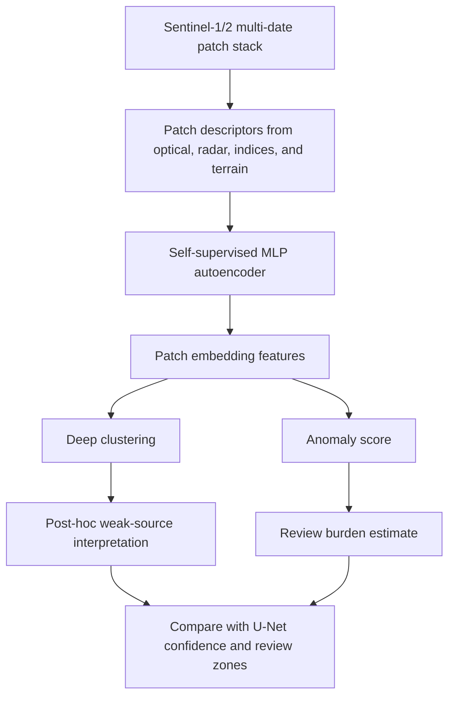

# Self-Supervised Embedding Track

This phase adds a label-free neural representation track beside the current
weak-supervised U-Net workflow.

It does not claim field accuracy. It asks whether Sentinel-1/2, index, radar,
and terrain patch features can be encoded into useful embeddings without class
labels, then interpreted afterward with Dynamic World, ESA WorldCover, OSM,
Sentinel indices, radar evidence, and existing high-confidence change polygons.

## Method



## No-Cheating Rules

- 2026 frozen benchmark patches are excluded from encoder fitting.
- Weak labels are not used to fit the scaler, autoencoder, or clusters.
- Weak sources are used only after fitting to interpret clusters.
- The output is a review and discovery layer, not a field-validated accuracy
  result.

## Why It Matters

U-Net is useful when weak labels exist, but it can inherit weak-label bias. The
self-supervised track provides an independent check:

- areas that reconstruct poorly become anomaly candidates
- clusters with mixed weak-source interpretation become review candidates
- clusters that are coherent across Sentinel/radar/terrain features can support
  review prioritization

## How To Run

```powershell
conda activate realtime_LCC_Rwkig
python pipelines/45_self_supervised_embedding_track.py
python pipelines/43_compare_model_tracks.py
python pipelines/46_export_self_supervised_review_layer.py
python pipelines/47_propose_self_supervised_review_samples.py
python pipelines/48_spatial_self_supervised_encoder.py
```

The main report is written to:

```text
data/outputs/self_supervised_embedding_track_report.json
```

The WebGIS/reviewer summary is written to:

```text
web/public/demo/self_supervised_embedding_track_summary.json
```

The review-patch overlay used by the WebGIS is written to:

```text
web/public/demo/self_supervised_review_patches.geojson
web/public/demo/self_supervised_review_layer_summary.json
```

These patch footprints are review evidence only. They should not be read as
field-validated change polygons or as wall-to-wall land-cover classes.

The review-sample manifest for future U-Net retraining is written to:

```text
data/outputs/self_supervised_review_sample_manifest.json
data/outputs/self_supervised_review_samples.geojson
```

The selected samples are balanced by review priority, dominant interpretation,
and year. They exclude the frozen 2026 benchmark and are meant to guide human
or independent review before any corrected labels are used for retraining.

The spatial encoder report is written to:

```text
data/outputs/spatial_self_supervised_encoder_report.json
```

On machines where PyTorch imports cleanly, this trains
`ConvPatchAutoencoder` on the 128 x 128 Sentinel feature tensors when explicitly
enabled:

```powershell
$env:LCC_ENABLE_TORCH_SPATIAL_ENCODER="1"
python pipelines/48_spatial_self_supervised_encoder.py
```

The default local run uses an 8 x 8 spatial-grid autoencoder. That fallback
avoids brittle PyTorch DLL imports on Windows, still preserves patch layout, and
keeps weak sources out of the fit.

## How To Read The Metrics

- `silhouette_score`: embedding-space cluster coherence, not accuracy.
- `weak_source_compatibility`: average post-hoc agreement with available weak
  evidence.
- `review_burden_fraction`: patches that have weak support below the reliability
  threshold or high anomaly scores.
- `mean_cluster_ambiguity`: how mixed the weak-source interpretations are inside
  clusters.
- `high_anomaly_fraction`: patches with high reconstruction or cluster-distance
  anomaly scores.

## Next Upgrade

This implementation is now two-stage: the original descriptor MLP remains the
CPU baseline, and Phase 65 adds a spatial patch encoder path. A true temporal
transformer still needs a repeated-window patch manifest because the current
balanced patch set does not preserve exact row/column windows across years.
