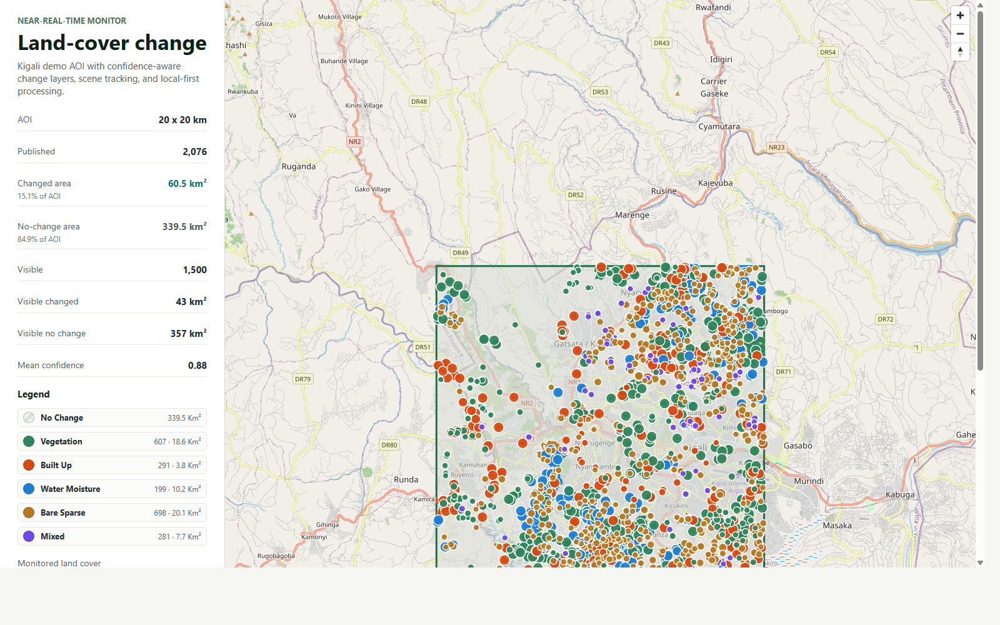

# Confidence-Aware Land-Cover Change Monitoring

[Open the interactive WebGIS app](app/)

Local-first GeoAI portfolio project for near-real-time land-cover change monitoring over a 20 km x 20 km Kigali peri-urban AOI.

## Demo Snapshot

```text
Published changes: 2,076
Changed area:      60.5 km²
No-change area:    339.5 km²
Mean confidence:   0.88
```



## What This Project Shows

- Sentinel-2 optical indices and Sentinel-1 radar features.
- AOI-windowed preprocessing to avoid full-tile reads.
- Multi-date change detection with baseline and after-change context.
- Confidence scoring before PostGIS publication.
- FastAPI endpoints for health, AOI, scenes, changes, summary, and GeoJSON.
- MapLibre WebGIS with monitored groups, changed/no-change quantities, and filters.
- Unsupervised validation overlay and validation summary panel for no-field-label review.
- CI checks and tag-based release packaging.

## Documentation

- [Architecture](ARCHITECTURE.md)
- [Operations](OPERATIONS.md)
- [Validation and reliability](VALIDATION.md)
- [CI/CD](CI_CD.md)
- [API examples](API_EXAMPLES.md)
- [Demo script](DEMO.md)
- [Portfolio review guide](PORTFOLIO_REVIEW.md)
- [References and scientific basis](REFERENCES.md)
- [Unsupervised validation](UNSUPERVISED_VALIDATION.md)
- [Class harmonization](CLASS_HARMONIZATION.md)
- [Weak labels](WEAK_LABELS.md)
- [External weak sources](EXTERNAL_WEAK_SOURCES.md)
- [Patch dataset](PATCH_DATASET.md)
- [Training scene discovery](TRAINING_SCENES.md)
- [Multi-year preprocessing](MULTI_YEAR_PREPROCESSING.md)
- [Multi-year training patches](MULTI_YEAR_PATCHES.md)
- [U-Net segmentation baseline](SEGMENTATION_BASELINE.md)
- [Screenshot guide](SCREENSHOT_GUIDE.md)
- [Release checklist](RELEASE_CHECKLIST.md)
- [Publishing guide](PUBLISHING.md)
- [Future ML/MLOps roadmap](ML_ROADMAP.md)
- [Issue backlog](ISSUE_BACKLOG.md)

## Repository

GitHub repository:

```text
https://github.com/Nkusial/LCC_Monitor_RwaKig
```
